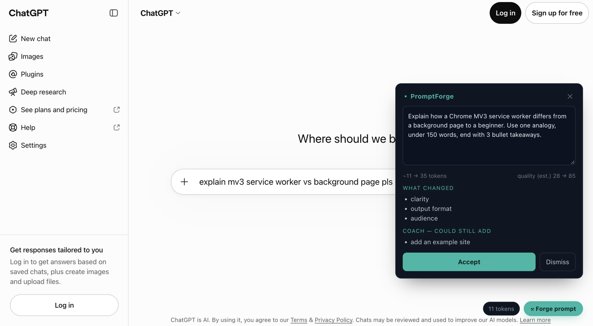

<div align="center">

# ⚒ PromptForge

**Type like you talk. Send a prompt an expert would write.**

PromptForge sits on the input box of Claude, ChatGPT, Gemini, Grok and Perplexity, and inside coding agents like Claude Code, Codex and Cursor. One tap rewrites your messy request into a clear, complete prompt, shows you what changed, and teaches you why.

[](https://github.com/Balaji91221/promptforge/actions/workflows/ci.yml)
[](LICENSE)
[](.nvmrc)
[](tsconfig.base.json)
[](apps/extension-browser)
[](apps/mcp)
[](CONTRIBUTING.md)

[Install](#install-in-2-minutes) · [Coding agents](#coding-agents-claude-code-codex-gemini-cli-cursor-windsurf) · [Status](#status) · [FAQ](#faq) · [Architecture](#architecture) · [Contributing](CONTRIBUTING.md)



<sub>PromptForge on chatgpt.com. The chat box holds "explain mv3 service worker vs background page pls"; the overlay shows the rewrite, what changed, and what could still be added. Sample output from a test model.</sub>

</div>

## Why

- **Most prompts are under-specified.** "Fix my resume" has no audience, no format, no success criteria. The model guesses, you re-ask, you lose a turn.
- **Prompt guides don't stick.** You read them once, then type the same way as before. PromptForge applies the techniques *where you type* and tells you which ones it used, so the habit forms.
- **Your words should stay yours.** No account, no server, no telemetry. Text leaves your device only when you tap Forge, and only to the model provider you chose with your own key.

```
you type               ⚒ Forge                   your model              you decide
"fix my resume    →   pre-clean → 1 LLM call  →  refined prompt     →   Accept · Edit · Dismiss
 for a PM role"       → parse → token delta       + what changed          (Accept writes it
                                                  + coach tips             into the chat box)
```

## What it does

- **Rewrite.** Raw input becomes a complete prompt. Every constraint you wrote is kept; nothing is invented.
- **Coach.** "What changed" shows the techniques applied; "could still add" shows what is missing. You learn by doing.
- **Measure.** Acceptance rate and edit rate, stored locally. Behavioral truth, not model self-grades.
- **Bring your own model.** Seven providers including a free tier (NVIDIA NIM) and fully local Ollama.
- **Long pastes stay intact and get smaller.** Paste a big JSON array; only your instruction is rewritten and the data is re-encoded on-device into a compact table, about half the tokens with every value kept.
- **Works in coding agents too.** The same engine is an [MCP server](apps/mcp) for Claude Code, Codex CLI, Gemini CLI, Cursor and Windsurf.

## Install in 2 minutes

Needs Node.js 22+ and a Chromium browser. Not on the Chrome Web Store yet; you load it from source.

```bash
git clone https://github.com/Balaji91221/promptforge.git && cd promptforge
npm install
npm run build:engine && npm run build --workspace apps/extension-browser
```

1. Open `chrome://extensions`, turn on **Developer mode**, click **Load unpacked**, pick `apps/extension-browser/dist`.
2. Click the PromptForge icon. Pick a provider and model. The default, NVIDIA NIM `llama-3.1-8b-instruct`, is free: get a key at [build.nvidia.com](https://build.nvidia.com). Paste the key, **Save**. The popup tests the connection live.
3. Open claude.ai, chatgpt.com, gemini.google.com, grok.com or perplexity.ai. Type. Tap **⚒ Forge prompt**.

<details>
<summary>Run it fully offline with Ollama</summary>

```bash
ollama pull llama3.1:8b
OLLAMA_ORIGINS="chrome-extension://*" ollama serve   # the Ollama desktop app blocks extension origins by default
```

In the popup choose **Ollama (local)**, model `llama3.1:8b`, no key. Nothing leaves your machine.
</details>

## Coding agents: Claude Code, Codex, Gemini CLI, Cursor, Windsurf

Say "forge this: fix my login bug" and the agent calls PromptForge, shows you the refined prompt and what changed, then works from it.

```bash
npm run build:engine && npm run build --workspace apps/mcp
claude mcp add --scope user --env NVIDIA_API_KEY=nvapi-… --transport stdio promptforge -- node "$PWD/apps/mcp/dist/index.js"
```

Config blocks for all five agents, the env variables and the tool contract are in [`apps/mcp/README.md`](apps/mcp/README.md). Inside this clone, `.mcp.json` already declares the server for Claude Code and reads your key from the shell.

## Status

Pre-1.0. Here is exactly what has been exercised and what has not.

| Surface | State | Notes |
|---|---|---|
| Chrome extension on chatgpt.com | **tested** | full loop: button, rewrite, overlay, Accept writes to the box |
| Chrome extension on claude.ai, Gemini, Grok, Perplexity | adapters written | selectors in place, not exercised in the latest test run; report breakage in an issue |
| MCP server in Claude Code | **tested** | live, headless, tool call and result verified |
| MCP server in Codex CLI, Gemini CLI, Cursor, Windsurf | doc-verified | config formats checked against vendor docs 2026-10-06, not run |
| VS Code "Refine selection" | builds | not exercised recently |
| CLI PTY wrapper (`apps/cli`) | legacy | fragile by design; use the MCP server instead |
| Hosted proxy, dashboard, landing page | optional | not needed to use the extension or the MCP server |
| Chrome Web Store listing | not yet | load unpacked for now |

Test coverage: 160 unit tests, 39 end-to-end checks against a mock provider, 12 MCP stdio checks, all in CI.

## Supported sites and models

**Sites:** claude.ai · chatgpt.com / chat.openai.com · gemini.google.com · grok.com and x.com/i/grok · perplexity.ai. Adding a site is one adapter file; see [CONTRIBUTING.md](CONTRIBUTING.md#add-a-chat-platform-adapter).

**Models:** one engine, seven providers.

| Provider | Recommended model | Key | Cost |
|---|---|---|---|
| **NVIDIA NIM** | `meta/llama-3.1-8b-instruct` | `nvapi-…` | free tier |
| OpenAI | `gpt-4o-mini` | `sk-…` | paid, well under a cent per forge |
| Anthropic | `claude-haiku-4-5` | `sk-ant-…` | paid, well under a cent per forge |
| Ollama (local) | `llama3.1:8b` | none | free, offline |
| HuggingFace | `Llama-3.3-70B-Instruct` | `hf_…` | free tier |
| OpenRouter | any open model | `sk-or-…` | varies |
| Custom | any OpenAI-compatible URL | optional | yours |

One forge is one model call, roughly 1,100 input and 300 output tokens. Adding a provider is one catalog entry; see [CONTRIBUTING.md](CONTRIBUTING.md#add-a-model-provider).

## FAQ

**Is my text sent anywhere?**
Only when you tap Forge, and only to the provider you configured. The extension reads the input box of supported sites and nothing else. No accounts, no analytics, no third-party storage. Keys live in `chrome.storage.local` on your device; for the MCP server they live in your agent's config.

**Does it cost money?**
No, with NVIDIA NIM's free tier or local Ollama. With paid providers, well under a cent per forge.

**Why not just ask ChatGPT to improve my prompt?**
You can. PromptForge does it in one tap, in place, with the same technique-level feedback every time, keeps the original so you can compare, and never sends anything until you ask. Over weeks the coach tips change how you type without the tool.

**Which model should I pick?**
Start with the free NVIDIA Llama 3.1 8B. It answers in about a second and it is the default the eval suite runs against. Bigger models give slightly better rewrites and slower responses.

**Why is it not on the Chrome Web Store?**
It is pre-1.0 and the acceptance-rate signal is still being collected. A store listing will follow once enough real usage shows the rewrites are worth it.

**Does it rewrite every prompt automatically?**
No. The extension is a button you tap. In coding agents the agent calls the tool when you ask or when your request is vague. An automatic mode for Claude Code (a hook) is on the roadmap.

**How do I know the rewrites are any good?**
Two ways. A meta-prompt eval suite runs on every change (`npm run eval`). And the popup shows your own acceptance rate: new features ship only once real users accept 40% or more of rewrites.

## Compressing long pastes

Paste a large JSON array with an instruction, tap Forge, and only the instruction is rewritten. The data is re-encoded on-device into a schema header plus CSV rows, the idea [Headroom](https://github.com/headroomlabs-ai/headroom) uses for tool output, and appended after the refined prompt. Measured on a 500-item array: about half the tokens, 500 of 500 ids kept, under 50 ms, no network.

| Engine | Install | When to pick it |
|---|---|---|
| **Built-in** (default) | none | always, unless you already run Headroom |
| Headroom proxy | `pip install "headroom-ai[proxy]"` then `headroom proxy` | you want Headroom's other routes or its stats dashboard |

Guardrails: only JSON arrays with 2+ items and 400+ tokens qualify; a result is used only if it saves 25% or more and is lossless; the engine has 1.5 s, in parallel with the rewrite, or the original data is appended unchanged. Measurements are in [the spike write-up](docs/spikes/2026-09-09-headroom-compress.md).

## Architecture

One engine, many shells. `packages/core` is a pure TypeScript library that answers "given messy text and a model config, return a structured rewrite." Every surface is a thin UI around that one call.

```
                        ┌─────────────────────────────┐
                        │        packages/core        │   the engine
                        │   pure TypeScript, no UI    │
                        └──────────────┬──────────────┘
                                       │ refine()
          ┌──────────────┬─────────────┼─────────────┬──────────────┐
          │              │             │             │              │
  ┌───────▼──────┐ ┌─────▼─────┐ ┌─────▼──────┐ ┌────▼─────┐ ┌──────▼──────┐
  │ extension-   │ │   mcp     │ │ extension- │ │   cli    │ │  backend    │
  │ browser      │ │ (agents)  │ │ vscode     │ │ (legacy) │ │ (optional)  │
  └──────────────┘ └───────────┘ └────────────┘ └──────────┘ └─────────────┘
```

Rule of thumb: a change to *what* a rewrite does (parsing, providers, tokens) belongs in `packages/core`. A change to *where you see it* belongs in a shell.

```
packages/
  core/               the engine: prompt-helper · optimizer · metering · providers · store
  adapters/           per-site DOM adapters (Claude, ChatGPT, Gemini, Grok, Perplexity)
  types/              shared types and output schema
apps/
  extension-browser/  Chrome MV3 shell: content script, service worker, popup
  mcp/                MCP server: forge_prompt for Claude Code, Codex, Gemini CLI, Cursor, Windsurf
  extension-vscode/   VS Code "Refine selection" command
  cli/                legacy PTY shim
  backend/            optional hosted-mode proxy
  dashboard/, landing/  optional Next.js dashboard and site
evals/                meta-prompt eval suite + end-to-end harnesses
docs/                 architecture tour, plans, spike write-ups
```

Guardrails baked in: opt-in button only · length gate (no model call on trivial input) · original always kept, diff always shown · 30 s provider timeout · minimal host permissions, never `<all_urls>` · deflection guard with a deterministic fallback · pasted data never edited or sent to the rewrite model.

Full code tour: [docs/ARCHITECTURE.md](docs/ARCHITECTURE.md). Development commands and conventions: [CONTRIBUTING.md](CONTRIBUTING.md).

## Roadmap

- Automatic forge in Claude Code via a `UserPromptSubmit` hook and a `/forge` command.
- A code-specific rewrite mode: repo paths, expected vs actual, test command, "don't touch" list.
- `npx @promptforge/mcp` one-line install for all agents.
- Chrome Web Store listing once the acceptance signal clears 40%.

Ideas and votes: [Discussions](https://github.com/Balaji91221/promptforge/discussions).

## Contributing

Contributions are welcome, from a typo fix to a new platform adapter. Start with [CONTRIBUTING.md](CONTRIBUTING.md). This project follows the [Contributor Covenant](CODE_OF_CONDUCT.md).

Good first contributions:

- Add a model provider (one catalog entry plus a test).
- Add a chat platform adapter (one file plus selectors).
- Add an eval case in `evals/cases.json` for a rewrite that went wrong.
- Try the MCP server in Codex, Gemini CLI, Cursor or Windsurf and report what you see.

## Security

Report vulnerabilities privately through GitHub's **Security → Report a vulnerability** tab, not as a public issue. Details in [SECURITY.md](SECURITY.md).

## Privacy

Local-first by design. The text you are typing is read only from the input box of supported sites and leaves your device only when you explicitly tap Forge, and then only to the model provider you configured with your key. No accounts, no telemetry, no third-party storage.

## License

[MIT](LICENSE) © Balaji91221
