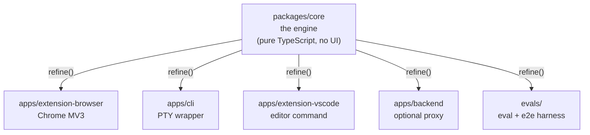
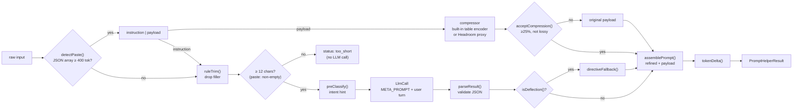
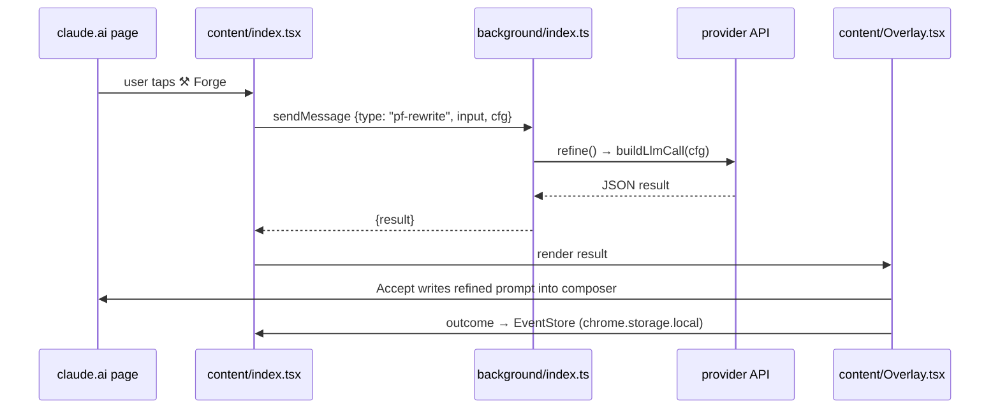

# Architecture

PromptForge is one engine with many shells. This document is the long tour.
The short version is in the [README](../README.md#architecture).

## One engine, many shells



**Rule of thumb:** a change to *what* a rewrite does (parsing, providers,
token counting) belongs in `packages/core`. A change to *where the user sees
it* (button, popup, terminal, editor) belongs in the shell.

## The rewrite pipeline



In paste mode the model call and the compressor run in parallel, so compression
adds at most the difference between the two. The payload is never trimmed,
never classified, and never sent to the rewrite model. See
[docs/spikes/2026-09-09-headroom-compress.md](spikes/2026-09-09-headroom-compress.md)
for the measurements behind every threshold.

Every step before the model call is free and deterministic. The model call is
the only network I/O, and it is injected by the shell through the `LlmCall`
interface so the engine stays isomorphic.

## The important folders, ranked by how much they matter

### 1. `packages/core/src/` — the engine

```
core/src/
├── prompt-helper/
│   ├── index.ts         refine() — the main function. Everything calls this.
│   ├── meta-prompt.ts   the instruction sent to the LLM, versioned
│   ├── parser.ts        turns the LLM's raw text into a validated result
│   ├── providers.ts     the 7-provider catalog + buildLlmCall() + testProvider()
│   └── templates.ts     cheap keyword-based intent guessing (no AI needed)
├── optimizer/
│   ├── trim.ts          free, instant filler-word removal (pre-clean)
│   ├── paste.ts         splitPaste() — instruction vs JSON-array payload, either order
│   ├── compress.ts      detectPaste(), compressPayload(), assemblePrompt() — compressor injected
│   ├── crusher.ts       built-in engine: content router + JSON-array → [N]{schema} + CSV rows
│   └── headroom.ts      optional Headroom proxy client + the acceptCompression() allowlist
├── metering/
│   └── tokenizer.ts     ~4-chars/token estimate for the live counter
└── shared/
    ├── store.ts         EventStore — records accept/edit/dismiss, computes G0 rate
    └── config-loader.ts versioned remote config (not active yet)
```

Every shell imports `refine()` from here and nothing else. Rewrite every shell
tomorrow and this folder is the only thing that has to survive unchanged.

### 2. `packages/adapters/src/` — knows about each AI website

```
adapters/src/
├── anthropic.ts   Claude.ai's CSS selectors (input box, send button)
├── openai.ts      ChatGPT's selectors
├── google.ts, xai.ts, perplexity.ts
└── index.ts       adapterForUrl() — picks the right one by hostname
```

Only the browser extension uses this. The CLI and VS Code shells don't inject
into a web page. If claude.ai changes its HTML, fix one file here.

### 3. `packages/types/src/index.ts` — the shared contract

One file. Defines `PromptHelperResult`, `PromptEvent`, `Outcome`, `Intent`.
Every package and shell imports types from here so the JSON shape never drifts.

## How each shell calls the engine

### Chrome extension (`apps/extension-browser/`)



Content scripts run inside the chat site's page and inherit its strict CSP and
CORS rules. The background service worker is a separate, privileged context.
Fetches from the worker to hosts listed in `host_permissions` bypass CORS,
which is the only reason a direct call to a provider API works.

Key files:

| File | Role |
|---|---|
| `src/content/index.tsx` | Injects the token counter and Forge button, opens the overlay, writes back to the composer |
| `src/content/Overlay.tsx` | Renders result, "what changed", coach tips, Accept / Dismiss |
| `src/background/index.ts` | Runs `refine()` and `testProvider()` on request |
| `src/popup/index.ts` | Provider/model/key form with live connection test, and the G0 stats |
| `src/content/model-config.ts`, `chrome-store.ts` | Persistence over `chrome.storage.local` |
| `src/manifest.ts` | MV3 manifest; host permissions come from the adapters |

### CLI (`apps/cli/src/index.ts`)

```
node-pty spawns the real tool (codex / claude / gemini) in a pseudo-terminal
        │
you type → CLI buffers keystrokes → press the refine hotkey (Ctrl-R)
        │
        │  calls refine(buffer, backendCall) — the same function as the extension
        ▼
rewritten text is injected back into the wrapped tool's stdin
```

A Node process has no CORS restrictions, so this shell needs no background
worker. It talks to the hosted proxy at `PF_API`.

### VS Code (`apps/extension-vscode/src/extension.ts`)

```
"Refine Selection" command → reads your text selection
        │  posts to the hosted proxy at PF_API, parses the result
        ▼
replaces the selection with the rewritten prompt
```

One command, one status-bar token counter.

## What is not load-bearing

Skip these when getting oriented. They don't affect the rewrite feature itself:

- `apps/backend/` — optional hosted-mode proxy with an in-memory reference
  store. The extension's worker calls providers directly instead.
- `apps/dashboard/`, `apps/landing/` — analytics view and marketing site.
- `evals/` — test harnesses, not shipped.
- `config/*.json` — bundled defaults for a future remote-config service.

## Validation gates

The roadmap is phased behind behavioural gates. Nothing past the Phase 0 MVP
ships until real usage clears a **40% rewrite-acceptance rate** (the G0 signal
shown in the popup). Acceptance is `(accepted + edited_then_sent) / decided`,
computed by `EventStore.acceptanceRate()` from events stored on the device.

## Guardrails baked in

- Opt-in button only. Nothing is sent on keystroke.
- Length gate: no LLM call on input under 12 characters after trimming.
- The original is always kept and the diff is always shown.
- 30-second provider timeout with a clear error instead of a spinner.
- Minimal host permissions. Never `<all_urls>`.
- Deflection guard: if the model asks the user for help instead of forging a
  prompt, a deterministic directive fallback is substituted and flagged.
- Paste guard: pasted data is never edited, never classified, never sent to the
  rewrite model. Compression is on-device, allowlisted, and falls back to the
  original within 1.5 s. The built-in encoder is a faithful re-encoding; the
  external proxy is loopback-only and opt-in.

**One-sentence mental model:** `packages/core` is a library that answers
*"given messy text and a model config, return a structured rewrite"*, and the
extension, CLI, and VS Code shells are three different UIs that ask it that
same question.
