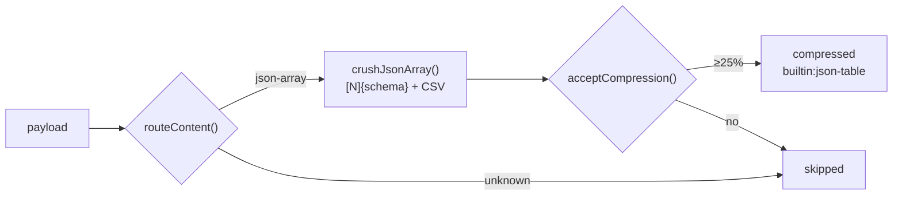

# Blueprint — Built-in compressor (Headroom concepts, no dependency)

**Type:** MODIFY · **Date:** 2026-09-09 · **Status:** Built and verified 2026-09-09 (148 unit, 39 e2e, 24 live checks green; built-in 29,214 → 14,730 tokens on the 500-item fixture by real tokenizer)

| | |
|---|---|
| **What** | Implement Headroom's proven concepts natively in TypeScript so large JSON pastes are compressed on-device with zero install. The external proxy stays available as an optional engine. |
| **Effort** | S (half a day) |
| **Done when** | `npm run e2e` shows the built-in engine compressing a 120-item paste ≥ 40% with every id kept and no network; the live script shows built-in vs Headroom side by side on 500 items. |

## 1. Needs & Goals

| | |
|---|---|
| **Now** | Paste mode works, but compression needs a 500 MB Python proxy running locally. |
| **Problem** | Almost no extension user will install that. The feature is invisible by default. |
| **Adding** | `optimizer/crusher.ts`: a content router + JSON-array "table" encoder (schema header + CSV rows), the shape that produced 50% lossless savings in the spike. Built-in becomes the default engine; Headroom becomes an optional alternative behind the same `PayloadCompressor` interface. |
| **After** | Paste a JSON array, tap Forge, see "attached data 29,267 → 14,783 tokens · built-in" with nothing installed and nothing sent anywhere. |

| Goal | How we know it's met |
|---|---|
| G-1 | Built-in engine: ≥ 40% saved on the 500-item live fixture, 500/500 ids, 2,000-char string intact. |
| G-2 | Every value round-trips: a CSV parser in the test reconstructs each cell from the table. |
| G-3 | Compression time < 50 ms for 500 items (pure string work, no I/O). |

## 2. Scope
| In | Out (for now) |
|---|---|
| JSON arrays of objects (flatten nested objects to dot keys, arrays as JSON cells) | Logs, diffs, prose (lossless folds alone stay under the 25% threshold; ML prose route dropped facts) |
| Router + transform ids + token accounting, same allowlist as Headroom | Reversible retrieval UI (original is already in the local event store) |
| Popup: engine select (built-in default / Headroom) | Arrays of primitives, heterogeneous arrays (fall through to no-op) |

## 3. Entry Criteria
- [x] Paste mode + `PayloadCompressor` interface in place and green (127 unit, 35 e2e)
- [x] Spike output format to match: `[N]{key:type,…}` + CSV rows (`docs/spikes/spike-run4.txt`)

## 4. Requirements
- R-1 Must work with nothing installed and make no network call.
- R-2 Must be lossless: every key and value of every item recoverable from the table.
- R-3 Must fall through to no-op (original data) for anything it cannot encode faithfully.
- R-4 Must report a transform id and token counts like the external engine so the UI is identical.

## 5. Functional / Non-functional

> **Functional = WHAT it does.** A feature. "User can log in."
> **Non-functional = HOW WELL it does it.** A measurable quality. "Login answers in under 2 seconds."
> **Quick test:** can you demo it? → Functional. Does it need a number? → Non-functional.

**Functional — what it does**
- FR-1 `routeContent()` classifies a payload as `json-array` or `unknown`.
- FR-2 `crushJsonArray()` emits `[N]{key:type,…}` then one RFC-4180 CSV row per item.
- FR-3 `builtinCompress` implements `PayloadCompressor` and runs through `acceptCompression()`.
- FR-4 A user can pick the engine in the popup; built-in is the default and needs no URL.

**Non-functional — how well**
- NFR-1 Speed: 500 items in under 50 ms.
- NFR-2 Accuracy: 100% of cells round-trip through a CSV parser in tests.
- NFR-3 Reliability: malformed or heterogeneous input → `skipped`, never a throw.
- NFR-4 Observability: transform id `builtin:json-table:<ratio>` visible in the overlay tooltip.

## 6. Architecture
| Layer | Choice | Why | Instead of |
|---|---|---|---|
| Encoder | schema header + CSV rows | removes repeated keys, braces, quotes; the exact shape the spike measured at 50% | YAML/TOON-style encodings (unmeasured) |
| Router | content-type switch inside the compressor | mirrors Headroom's ContentRouter so log/diff encoders can be added as one case each | one monolithic function |
| Default | built-in on, Headroom optional | zero install; same interface, same allowlist, same UI | external-only |

## 7. Folder Structure
| File | Action | Change |
|---|---|---|
| `packages/core/src/optimizer/crusher.ts` | add | router, flattener, CSV encoder, `builtinCompress` |
| `packages/core/src/optimizer/crusher.test.ts` | add | round-trip, escaping, nesting, ratio, no-op paths |
| `packages/types/src/index.ts` | edit | `provider: "builtin" \| "headroom"` |
| `packages/core/src/optimizer/compress.ts` | edit | `compressPayload` takes provider from the outcome |
| `apps/extension-browser/src/content/settings.ts` | edit | `compress` (default true), `engine`, `headroomUrl` |
| `apps/extension-browser/src/background/index.ts` | edit | pick engine |
| `apps/extension-browser/src/popup/*` | edit | engine select |
| `evals/e2e-extension.ts`, `evals/headroom-live.ts` | edit | built-in scenario; side-by-side comparison |
| README, ARCHITECTURE, CHANGELOG, core README | edit | |

## 8. Change Impact
| Depends on it | Could break | Test to run |
|---|---|---|
| `compressPayload()` callers (refine) | provider field now comes from the outcome | unit + e2e |
| Settings readers | key rename `headroom` → `engine` (uncommitted, no users) | build |

## 9. Phases
| # | Goal | Effort | You'll see |
|---|---|---|---|
| 1 | crusher + tests | S | `npm test` green, ratio ≥ 40% on fixture |
| 2 | wiring + popup + e2e + live comparison | S | `npm run e2e` built-in scenario; live prints both engines |
| 3 | docs | S | lint/typecheck/test/e2e/builds green |

## 10. Risks & Rollback
| Risk | Mitigation |
|---|---|
| Heterogeneous arrays produce sparse tables with poor savings | union schema + empty cells; allowlist rejects < 25% → original kept |
| Values containing commas/quotes/newlines | RFC-4180 quoting, tested with a parser round-trip |
| Very deep nesting | flatten to depth 3, deeper → JSON cell |

**Rollback:** `git checkout -- . && git clean -fd` (all uncommitted); rollback point `fb68e52`.
