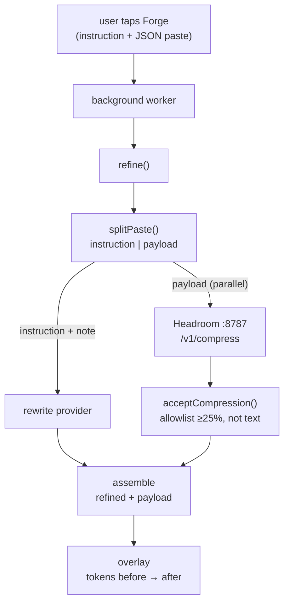

# Blueprint — Headroom compression for long pastes

**Type:** MODIFY · **Date:** 2026-09-09 · **Status:** Built and verified 2026-09-09; superseded as the default engine by `PLAN-modify-builtin-compressor.md` (Headroom is now the optional external engine)

| | |
|---|---|
| **What** | When a user pastes a large JSON array into a chat and taps Forge, compress the paste locally with Headroom, rewrite only the instruction, and reassemble. |
| **Effort** | M (1 day) |
| **Done when** | `npm run e2e` shows a 500-item JSON paste forged with tokens_after < tokens_before, all ids kept, and the same flow falls back cleanly with the proxy down. |

## 1. Needs & Goals

**For whom:** a PromptForge user who pastes search results, API responses, or exports (JSON arrays) into Claude/ChatGPT and asks for a summary or a fix.

| | |
|---|---|
| **Now** | `refine()` sends the whole input to the rewrite model and asks it to return the refined prompt. `max_tokens` is 1024. `compress.ts` is an empty slot (`CompressCall`, 400-token threshold) wired to nothing. |
| **Problem** | A 5K-token paste cannot come back inside 1024 tokens, so the "refined prompt" silently loses the data. `ruleTrim` also edits filler words inside pasted data. No token saving is ever real. |
| **Adding** | A paste splitter (instruction vs payload), a Headroom client (`POST /v1/compress`, tool-result shape), an accept/reject allowlist, parallel rewrite + compress, local reassembly, a popup toggle with health probe, overlay display, mock and live e2e. |
| **After** | Instruction is rewritten by the model; the payload never leaves the device for rewriting; if the local Headroom proxy is on, JSON payloads shrink ~50% with every id kept; if it is off or slow, the original payload is appended unchanged. |

| Goal | How we know it's met |
|---|---|
| G-1 | 500-item JSON paste: tokens_after ≤ 60% of tokens_before, 500/500 ids present in the assembled prompt (live e2e against the real proxy). |
| G-2 | Proxy down, proxy slow (>1.5 s), proxy returns `router:text`: Forge still succeeds, payload unchanged, no compression info shown (mock e2e). |
| G-3 | Added wall-clock ≤ 100 ms when the proxy answers within the model call (compress runs in parallel). |

## 2. Scope
| In | Out (for now) |
|---|---|
| JSON top-level arrays with ≥ 2 items, payload ≥ 400 tokens | Prose, logs, CSV, NDJSON, JSON objects (spike: prose drops facts; logs untested for lossless config) |
| Chrome extension (background worker + popup + overlay) | CLI, VS Code, backend proxy paths |
| Core: splitter, client, allowlist, reassembly, types | Headroom's reversible CCR retrieve (chat sites cannot call tools) |
| Mock e2e + live e2e script | Auto-installing or starting the proxy |

## 3. Entry Criteria — start only when ALL are ticked
- [x] User approved ("checking properly end to end fix it headroom concepts")
- [x] Node 22+ (check: `node --version` → v26.7.0)
- [x] Repo tests green before change (check: `npm test` → 64 passed; `npm run e2e` → 22 checks)
- [x] Live proxy available for the live check (check: `hr-venv-arm/bin/headroom proxy --port 8787`, `curl :8787/health` → `"status":"healthy"`)
- [x] Spike numbers in hand: `docs/spikes/2026-09-09-headroom-compress.md`

## 4. Requirements
- R-1 The user must opt in; compression is off by default.
- R-2 The user's instruction text must never be sent to the compressor's output path or altered by it.
- R-3 Nothing leaves the device except the instruction sent to the user's chosen rewrite provider.
- R-4 If the proxy is unavailable, slow, or returns a lossy transform, Forge must behave exactly as with compression off.
- R-5 The overlay must show before/after tokens for the compressed data so the saving is visible.
- R-6 The popup must show whether the proxy is reachable and how to start it.

## 5. Functional / Non-functional

> **Functional = WHAT it does.** A feature. "User can log in."
> **Non-functional = HOW WELL it does it.** A measurable quality. "Login answers in under 2 seconds."
> **Quick test:** can you demo it? → Functional. Does it need a number? → Non-functional.

**Functional — what it does**
- FR-1 `splitPaste()` separates an instruction from a JSON-array payload, in either order.
- FR-2 `refine()` in paste mode sends the model the instruction plus a one-line attachment note, never the payload.
- FR-3 `refine()` reassembles `refined instruction + "\n\n" + payload` and reports `compression` when Headroom was applied.
- FR-4 `buildHeadroomCompress()` posts the payload as a tool-result message and reads back only the tool message.
- FR-5 `acceptCompression()` rejects `router:text`, `noop`, savings under 25%, or empty output.
- FR-6 A user can toggle Headroom and set its URL in the popup and see a live health status.
- FR-7 The overlay shows "attached data 29,220 → 14,736 tokens (Headroom)".

**Non-functional — how well** (each ends with a number)
- NFR-1 Speed: compress runs in parallel with the rewrite; client timeout 1,500 ms; health probe timeout 800 ms.
- NFR-2 Security: proxy URL must be loopback (`localhost` or `127.0.0.1`); anything else is rejected at settings save. 0 new host permissions.
- NFR-3 Reliability: 3 failure modes (down, timeout, lossy transform) covered by e2e; fallback result byte-identical to compression-off path.
- NFR-4 Observability: popup health line shows version and latency in ms; overlay shows transforms applied; e2e prints per-scenario token counts.
- NFR-5 Accuracy: live check asserts 500/500 ids and one 2,000-char string intact.
- NFR-6 Cost: 0 network calls, 0 API spend for compression.

## 6. Architecture

| Layer | Choice | Why | Instead of |
|---|---|---|---|
| Compressor | Headroom proxy `POST /v1/compress`, local | 50% on JSON at 20–60 ms, lossless on all checks (spike) | npm `headroom-ai` SDK: same HTTP call plus 4 peer deps |
| Message shape | tool-result message | returns plain text with real newlines; user-message shape returns a quoted `\n`-escaped string | unescaping a JSON string literal |
| Where it runs | core (pure), invoked from the MV3 background worker | worker has host permission for localhost; core stays isomorphic | content script (blocked by page CSP) |
| Gate | JSON array ≥ 2 items, ≥ 400 tokens | only shape proven lossless in the spike | compress everything |
| Guardrail | allowlist on `transforms_applied` + ≥ 25% saving | `router:text` dropped facts 5/5 runs | trusting the proxy |
| Latency budget | rewrite ~1 s (Llama 8B) ∥ compress ≤ 1.5 s | parallel, worst case +0.5 s | sequential (+1.5 s) |
| Storage | `chrome.storage.local` via existing `Settings` | already device-scoped | new store |



**Flow:** 1. Worker reads settings; if Headroom is on, builds a compressor. 2. `refine()` splits; if no structured payload ≥ 400 tokens, runs as today. 3. Model call and compress call start together. 4. Compression accepted only if the allowlist passes; otherwise the original payload is used. 5. Result carries `compression` info; overlay renders it; Accept writes the assembled prompt into the composer.

## 7. Folder Structure

```
packages/types/src/index.ts              # edit: CompressionInfo, PromptHelperResult.compression
packages/core/src/optimizer/
├── paste.ts                             # add: splitPaste(), looksLikeJsonArray()
├── paste.test.ts                        # add
├── headroom.ts                          # add: buildHeadroomCompress(), headroomHealth(), acceptCompression()
├── headroom.test.ts                     # add: fetch mocked
├── compress.ts                          # edit: PayloadCompressor, CompressOutcome, compressPaste(); drop unused CompressCall
├── compress.test.ts                     # add
packages/core/src/prompt-helper/
├── meta-prompt.ts                       # edit: buildUserTurn(…, attachment?)
├── index.ts                             # edit: refine(raw, call, opts?) paste mode, parallel compress, assembly
├── refine.test.ts                       # edit: paste-mode cases
packages/core/src/index.ts               # edit: exports
apps/extension-browser/src/
├── content/settings.ts                  # edit: headroom, headroomUrl
├── background/index.ts                  # edit: build compressor from settings; pf-headroom-health message
├── popup/index.html                     # edit: Compression section
├── popup/index.ts                       # edit: toggle, url, health status
├── content/Overlay.tsx                  # edit: compression line
evals/e2e-extension.ts                   # edit: mock Headroom + 4 paste scenarios
evals/headroom-live.ts                   # add: live check against real proxy (skips if down)
README.md, docs/ARCHITECTURE.md, CHANGELOG.md, .env.example   # edit
```

| File | Action | Change |
|---|---|---|
| `packages/core/src/optimizer/compress.ts` | edit | replace unused `CompressCall`/`compress()` (0 callers) with `PayloadCompressor`/`compressPaste()` |
| `packages/core/src/index.ts` | edit | export new symbols, drop `CompressCall` |
| others | see tree | |

## 8. Change Impact
| Depends on it | Could break | Test to run |
|---|---|---|
| `refine()` callers: background worker, backend `rewrite.ts`, CLI, VS Code, eval runner, e2e | paste-mode split changes what the model receives for inputs with a blank line followed by a JSON array; all other inputs unchanged | `npm test`, `npm run e2e`, `npm run eval` (dry), `npm run typecheck` |
| `PromptHelperResult` consumers: Overlay, dashboard `summarize()`, backend, store | new optional field only; no reader breaks | typecheck all workspaces |
| `Settings` readers: content script, popup | new keys with defaults; old stored settings still valid | popup manual check, build |
| `compress`, `CompressCall` exports | 0 callers in repo (grep) | typecheck |

## 9. Phases
| # | Goal | Tasks | Files | Effort | You'll see |
|---|---|---|---|---|---|
| 1 | Core primitives | types, `paste.ts`, `headroom.ts`, `compress.ts` + tests | core/optimizer, types | S | `npm test` green with ~20 new tests |
| 2 | Pipeline | `refine()` paste mode, parallel compress, assembly, `buildUserTurn` note + tests | prompt-helper | S | refine test: model never sees payload |
| 3 | Extension | settings, background, popup section + health, overlay line | extension-browser | S | `npm run build --workspace apps/extension-browser` |
| 4 | Verify end to end | mock Headroom in e2e (4 scenarios), live script vs real proxy | evals | S | `npm run e2e` all pass; live: 500/500 ids, ≥40% saved |
| 5 | Docs | README section, ARCHITECTURE pipeline, CHANGELOG, `.env.example` | docs | S | lint + typecheck + tests + builds green |

## 10. Risks & Rollback
| Risk | Mitigation |
|---|---|
| MV3 worker → loopback proxy untested in Chrome | Same path Ollama already uses; popup health button gives a one-tap check; documented manual step |
| Proxy cold start 0.9–10 s | 1.5 s timeout, fallback to original; health probe on popup open shows "starting" |
| Splitter misfires on a JSON-looking instruction | strict gate: `JSON.parse` succeeds, top-level array, ≥ 2 items, ≥ 400 tokens; unit tests for both orders and no-payload |
| Model rewrites the instruction to reproduce data | attachment note says "do not reproduce"; payload appended by code regardless |
| Headroom API changes (v0.37) | response validated by a type guard; any shape mismatch → `failed` → fallback |

**Rollback:** uncommitted → `git checkout -- . && git clean -fd packages/core/src/optimizer evals docs`; committed → `git revert <sha>`. Rollback point: `fb68e52`.
